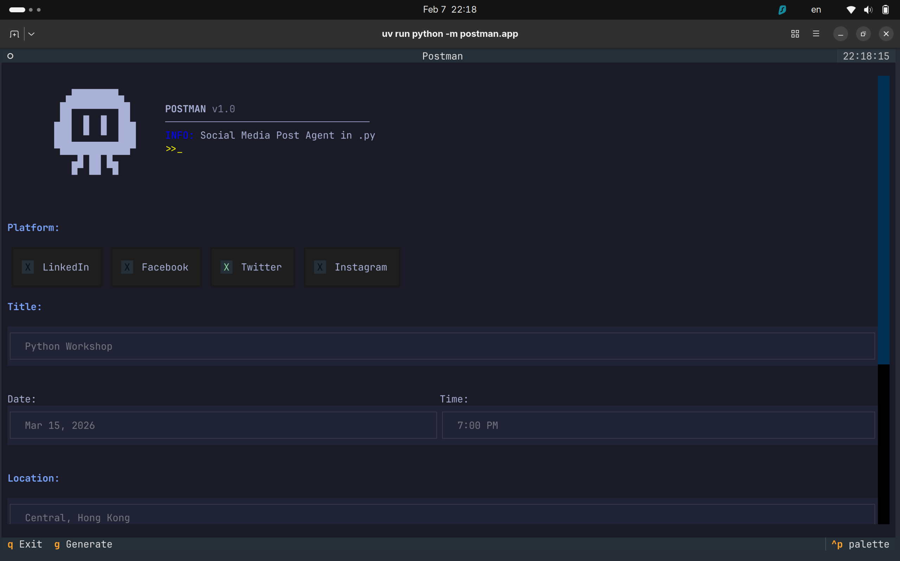

# Postman

A TUI application for generating social media posts for Hong Kong Python User Group events.

## Screenshot



## Features

- **Interactive TUI**: Built with Textual for a smooth terminal experience
- **Multi-platform**: Generate posts optimized for LinkedIn, Facebook, Twitter, and Instagram
- **LLM-powered**: Uses OpenRouter API with LangChain for intelligent content generation

## Requirements

- Python 3.14+
- OpenRouter API key

## Usage

```bash
uv venv
source .venv/bin/activate

uv sync

cp .env.example .env
# Edit .env and add your OpenRouter API key

uv run postman 
```

### Using the App

1. **Fill in event details**: Enter the event title, date, time, location, and description
2. **Select platform**: Choose from linkedin, facebook, twitter, or instagram
3. **Click Generate**: The AI will create a platform-optimized post
4. **Copy to clipboard**: Use the Copy button or press `c` to copy the generated post
5. **Exit**: Press `q` or click Exit to close

## Keyboard Shortcuts

- `q` - Exit application
- `g` - Generate post
- `c` - Copy to clipboard
- `Tab` - Navigate between fields

## Configuration

Environment variables (in `.env` file):

- `OPENROUTER_API_KEY` - Your OpenRouter API key (required)
- `OPENROUTER_MODEL` - Model to use (default: gpt-3.5-turbo)
- `POSTMAN_MIN_WIDTH` - Minimum terminal width (default: 80)
- `POSTMAN_MIN_HEIGHT` - Minimum terminal height (default: 24)
- `POSTMAN_DEBUG` - Enable debug mode (default: 0)

## License

MIT License - See LICENSE file for details.
